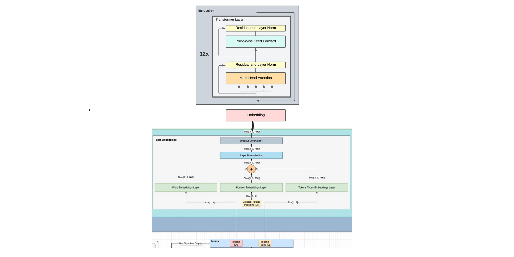

# Phishing Website Detection

## Team Contributions

| Team Member   | Contributions                                                                                                                                 |
|---------------|-----------------------------------------------------------------------------------------------------------------------------------------------|
| **Talha Taiyoub** | Contributed to every aspect of the project, including data preprocessing, model development, data augmentation, training, testing, and evaluation. |

## Model File

The trained model used for this project can be accessed via the following link:

🔗 **[Download Trained Model (Google Drive)](https://drive.google.com/file/d/1d8PxXpxqvhOD6axgk0RW6TstQ7DNP1eM/view?usp=sharing)**

The dataset was collected from **[Mendely Data](https://data.mendeley.com/datasets/vfszbj9b36/1)**

## Data Augmentation

To improve the robustness of the phishing detection model, several data augmentation techniques were employed to generate diverse URL variations. These techniques include:

1. **Synonym Replacement (SR)**: Replacing words in the URL with their synonyms to create variations without altering the meaning.
2. **Random Insertion (RI)**: Adding security-related terms or random characters to the URL to simulate common phishing attempts.
3. **Random Deletion (RD)**: Removing characters or words from the URL, which can often be used in obfuscating phishing sites.
4. **Random Swap (RS)**: Swapping parts of the URL, such as changing the order of subdomains or paths.
5. **Homoglyph Substitution**: Replacing characters in the URL with visually similar lookalikes (e.g., "g00gle.com" instead of "google.com").
6. **Synthetic URL Generation**: Creating completely new, synthetic phishing-like URLs based on known patterns of phishing sites.
7. **TLD Manipulation**: Altering domain extensions (e.g., changing ".com" to ".xyz") to simulate deceptive domain names.

These methods help to create a more diverse and comprehensive dataset for training the model.

## Performance Metrics (5-Fold Cross-Validation)

| Metric    | Score  |
|-----------|--------|
| Accuracy  | 0.9753 |
| Precision | 0.9680 |
| Recall    | 0.9654 |
| F1-Score  | 0.9666 |

## Confusion Matrix
|                 | Predicted Legitimate | Predicted Phishing |
|-----------------|----------------------|---------------------|
| **Actual Legitimate** | 61072                 | 1165                |
| **Actual Phishing**    | 1263                  | 35265               |

## Network Architecture

We used HuggingFace's `BertForSequenceClassification` model as the core of our phishing URL detection system.

### Details:

- **Base model**: `bert-base-uncased` (pretrained BERT with 12 transformer layers, 768 hidden size, 12 attention heads)
- **Classification head**: A single linear layer added on top of BERT’s `[CLS]` token output, with output size = 2 (for binary classification)
- **Activation function**: Softmax (applied during prediction for class probabilities)

**Input**: Tokenized URL text  
**Output**: Logits for two classes — `[Legitimate, Phishing]`

